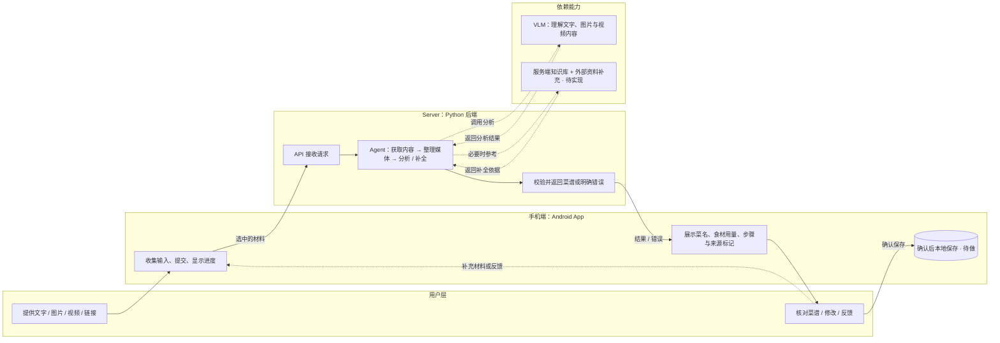
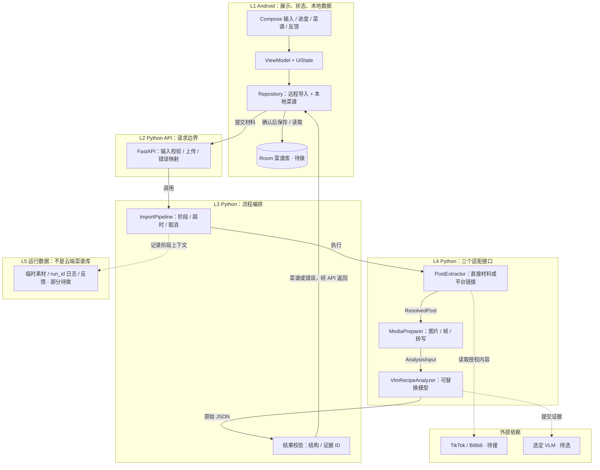

# 分层架构与实施路线

更新：2026-09-22。产品共识见 [PROJECT.md](../PROJECT.md)。图为目标架构；“待做”尚未实现。层是代码职责，不意味着拆成多个服务。

V1 目标 2026-10-31；每周交付、进度和验收门槛见 [MILESTONES](MILESTONES.md)。

2026-09-28契约更新：[W1.1草案](RECIPE_CONTRACT.md)规定美制/°F、份数/时间/每步用量、预估与显式AI冲突推荐；均为待实现。关联作者菜谱网站纳入内容获取；用户库存/饮食类型个性化延至V3。

## 零层总览：从用户输入到菜谱输出

这是端到端目标流程，先看系统各方如何协作；下文 L1–L5 再拆代码职责。当前 Android 与 Python 尚未联通。

- **用户**提供材料并确认结果；**App**负责交互与本地菜谱；**Server**负责接收请求、执行和返回结果。
- **现有 Agent 流程**是 Python 固定处理流程；下一步优先验证 OpenAI Agents API：模型/工具循环托管，Python 保留素材处理、工具执行、知识入库与结果校验。上图按逻辑职责分层，托管接入未实现，见[评估及验证顺序](AGENTS_API_ASSESSMENT.md)。
- **输出区分原文提取与 AI 预估**：按 PROJECT 最新方向，补全内容需标“预估”并供用户确认；不能伪装成原文事实。失败保留输入，提供原因及重试入口。
- **现状差异**：代码仍是演示，缺失数量保持 null；知识补全、预估字段和对应 eval 尚未实现，知识来源/检索方式待定。下文现有契约与“不猜测”验收仍需随该能力落地调整。
- **保存范围**：V1/V2 菜谱只存手机本地；V3 才增加账号、云同步与换手机恢复。

## 版本边界

| 版本 | 用户与首要目标 | 输入 / 存储 |
| --- | --- | --- |
| V1 | 两人内部 demo；功能与准确优先，成本/延迟先记录 | P0 文字+图片 → P1 视频 → P2 TikTok/Bilibili 链接；菜谱手机本地保存 |
| V2 | 少量用户；质量不明显下降的前提下降成本/延迟 | 延续本地菜谱；补齐访问控制、配额和运行保障 |
| V3 | 更多用户；成本、延迟、容量共同优化 | 加账号、云端菜谱同步、换手机登录恢复 |

P0/P1/P2 是 V1 输入优先级；A–G 是下面可逐段验收的实施顺序。

## 分层图

图中 Python 全流程超时/取消是目标；当前只有模型请求超时，尚无总时限或服务端任务取消。Android 已有演示取消。

## 每层职责与现状

| 层 | 输入 → 输出 | 主要文件 / 当前状态 |
| --- | --- | --- |
| L1 展示与状态 | 用户操作 → 请求；结果 → 详情、确认、本地保存 | Android ui、RecipeViewModel、RecipeRepository；界面已有，HTTP/Room/反馈待做 |
| L2 API | 文字和素材引用 → 校验后的请求 | backend/app/main.py；仅 health 和固定例子接口，上传待做 |
| L3 编排与校验 | 请求 → 菜谱或明确错误 | pipeline.py、schemas.py；固定流程及结构/引用校验已有，语义准确性靠 eval |
| L4 内容获取 | 直接材料或链接 → ResolvedPost | extractors/；目前仅 fixture，直接输入与两平台适配待做 |
| L4 媒体准备 | ResolvedPost → 带 ID 的证据 | media/；能读本地图片、预抽帧和已有转写；视频解码/转写待做 |
| L4 模型适配 | AnalysisInput → 菜谱 JSON | models/；demo、Ollama 适配代码已有，真实推理待验证 |
| L5 运行数据 | 素材/阶段上下文 → 可复现记录 | CLI outputs 已有；HTTP 日志、素材清理、反馈待做 |

三接口见 [ports.py](../backend/app/ports.py)，当前契约见 [schemas.py](../backend/app/schemas.py)。Android 后续通过 HTTP 调用 Python，不复制真实提取逻辑；本地演示可保留作测试。

## 接口与数据边界

**2026-10-02知识方案（待实现）**：服务端知识库优先 → 缺失时查询Wikipedia/烹饪网站API → 形成有来源的候选资料 → 校验去重 → 更新知识库 → 为补全提供依据。建议在backend新增knowledge模块供流程调用；三大导入接口保留，知识检索不是模型权重训练。

- 建议记录来源URL/提供方、获取时间、适用食材/份数/方法、版本和校验状态；来源冲突不直接覆盖旧值，模型自己的输出不作为独立外部事实回写。
- Wikipedia建议用于食材/术语背景，具体配方优先有明确份数与步骤的菜谱来源；外部API覆盖、存储许可与访问方式需逐个核实，不能假定所有网站都有可用API。
- 外部获取失败时保留已有证据和未知项，返回可解释状态；限制查找轮次与超时，避免无限搜索。入库质量门槛、数据库实现与刷新策略待定。
- Agent可作为Python内部工作流接入；建议以现有FastAPI包住Agent入口，继续返回菜谱契约。具体SDK/VLM尚未选定，未实施。

- **现有 API**：GET /health、POST /v1/imports/example；只跑固定例子。
- **P0 拟新增**：POST /v1/assets 上传图片返回 asset_id；POST /v1/imports 接收 text + asset_ids，返回 run_id + recipe 或结构化错误。先同步请求，上传格式实施时确定。
- **P1 拟扩展**：视频长任务创建返回 202；GET /v1/imports/{id} 查询，DELETE /v1/imports/{id} 请求取消；client_request_id 做幂等。持久任务状态不等于菜谱云同步。
- **P2 拟扩展**：导入入口增加 url；TikTok/Bilibili及明确关联的作者菜谱页作为证据，合并后复用媒体/模型流程；获取失败允许改传原始材料。
- **结果**：当前代码只有title、servings、ingredients、steps、warnings，未知量为null；目标增加时间、份数组别、步骤用量/半成品引用、字段来源、冲突候选与AI推荐，美制/°F输出。原始事实与补全严格区分，详见W1.1草案。
- **数据**：V1/V2 手机保存确认后的菜谱和必要附件；服务端临时处理素材及诊断，不做用户菜谱云库。未选择的数据不上传，Key 仅服务端；素材/日志保留期限待定。
- **部署**：V1 两台手机调用开发电脑上的单个 Python 服务，先本机/USB 联调，再内部网络访问；无需微服务。对外访问前补访问控制。

## 分段实施与验收

| 段 | 范围与主要文件 | 完成标准 |
| --- | --- | --- |
| A · V1/P0 | Python 固定文字+图片 → 真实 VLM；models、prompts、examples | 保存输入/输出；核对提取准确性与补全合理性；预估需标注，建立两类 eval 基线 |
| B · V1/P0 | 直接输入/图片上传 API + Android HTTP；main、schemas、Repository、输入页 | 手机材料得到对应菜谱；错误/断网/超时不白屏，保留输入；取消后迟到结果不插入列表 |
| C · V1/P0 | 确认/编辑、Room、反馈、run_id 日志 | 两人各自重启 App 后菜谱仍在；反馈能重现错误；完成文字+图片闭环 |
| D · V1/P1 | 视频上传、抽帧/转写、长任务状态与取消；media、pipeline、API | 固定视频菜谱可核对，证据有时间戳；取消停止后续工作，重试不重复保存 |
| E · V1/P2 | TikTok/Bilibili；extractors | 两平台各有真实案例；受限/失效链接明确失败；短链与下载边界校验 |
| F · V2 | 小范围发布、模型/媒体调优、计量/配额、Crashlytics | 同题对比质量、成本和延迟；先约定质量下降容忍值，再决定发布 |
| G · V3 | 容量压测，按需 worker/队列；账号、云库、同步 | 达到约定并发/延迟；换手机恢复；验证数据隔离、离线冲突及删除同步 |

每段：实现 → 针对性测试/人工 eval → 记录结论 → commit 可运行版本。模拟 HTTP 测试不能算真实模型质量通过。

## 评测与待定项

- V1：食材遗漏、数量准确、步骤顺序、不编造、端到端可用；成本/延迟只先记录。基本超时、有限重试和输入限制仍需有。
- V2：同题比较质量、每次成功导入成本、p50/p95 延迟；V3 加并发、吞吐、失败率与同步正确性。
- 待定：VLM、V1 准确率门槛、V2 质量下降容忍值/预算/延迟目标、视频大小与时长限制、数据保留期限、V3 容量目标与同步冲突策略。
